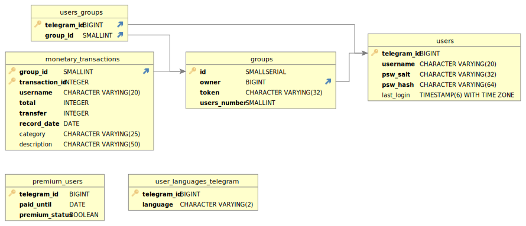

# Project documentation

## Database

### Scheme

At the moment, the “user” entity cannot exist outside the group and because of this we had to abandon the connection of the premium_users table with the users table.

The table "user_languages_telegram" is necessary to select a specific language inside the telegram bot; the site is planned to be multilingual based on a different principle, but if there is an entry in this table, the language will be offered on the site.
